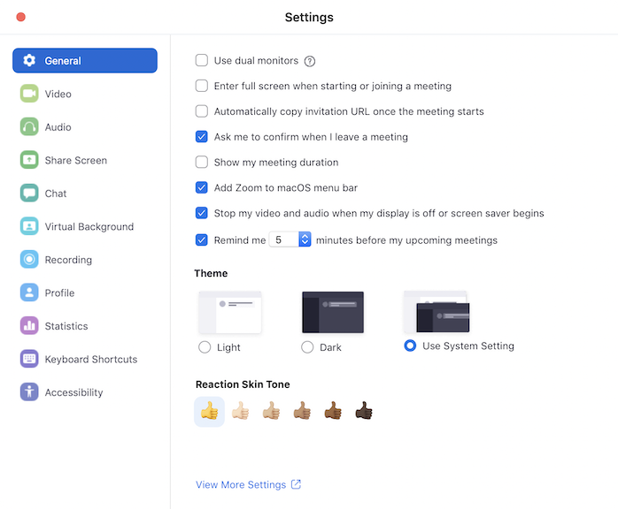
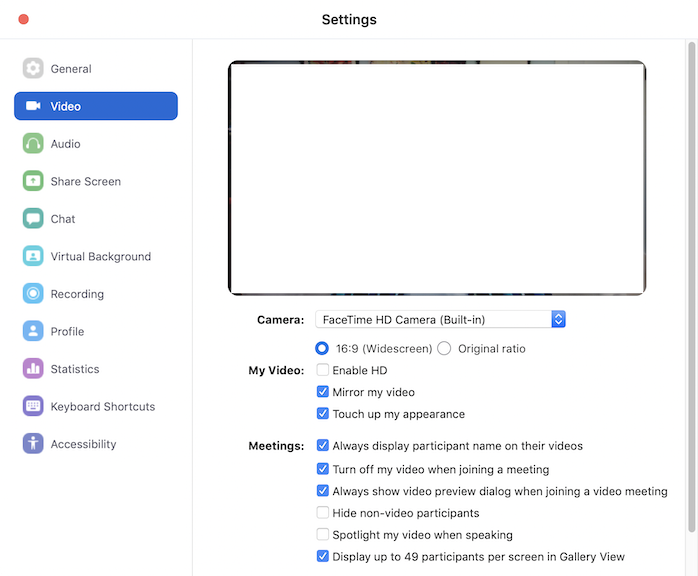
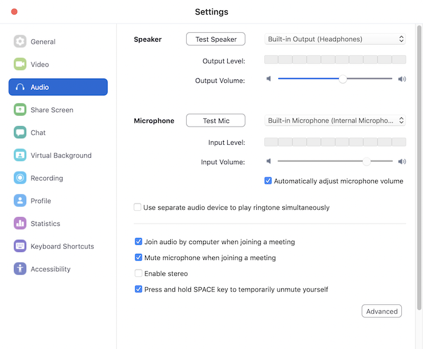
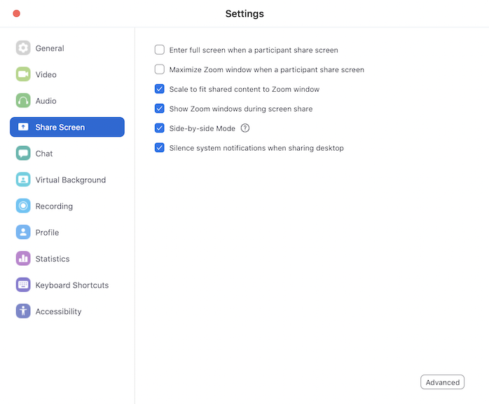
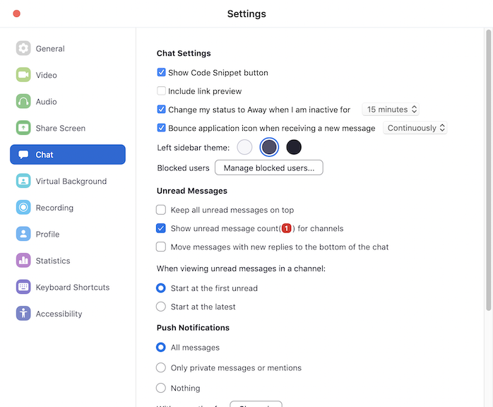
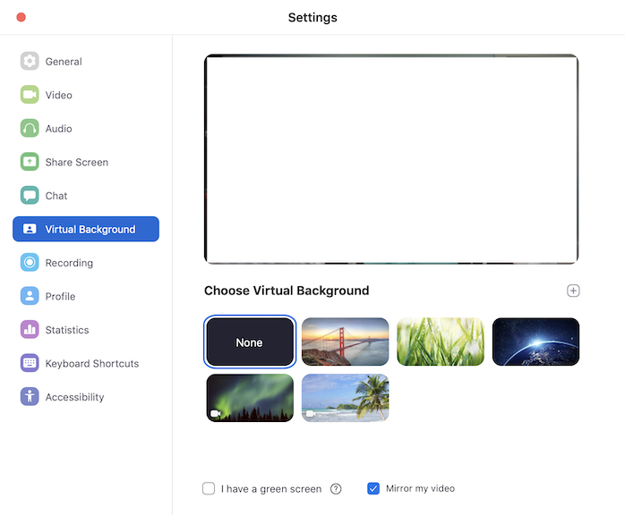
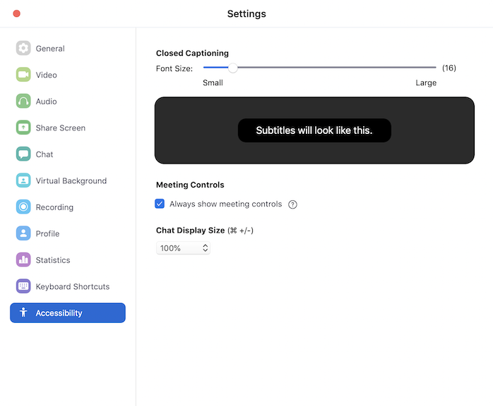

### Zoom Settings

These suggestions will help ensure you have a comfortable Zoom experience and do not consume 
large amounts of your network bandwidth. Before reviewing the recommended settings 
below, ensure you have the latest version of Zoom by checking for updates.

The following settings are listed in the order in which they appear in the Settings windows. 
The ones listed should be Off or On as indicated; if not listed, it is your preference.
Please see Zoom's document on [Changing Settings](https://support.zoom.us/hc/en-us/articles/201362623-Changing-settings-in-the-desktop-client-or-mobile-app) 
for complete details on all Zoom settings. 

*General:*

 
* On: Use dual monitors
* Off: Enter full screen when starting or joining a meeting
* On: Ask me to confirm when I leave a meeting
* On: Stop my video and audio when my display is off or screen saver begins

***

*Video*

My Video:
* Off: Enable HD
* On: Touch up my appearance

Meetings:
* On: Always display participant names on their video
* On: Turn off my video when joining a meeting
* On: Always show video preview dialog when joining a video meeting
* Off: Spotlight my video when speaking
* On: Display up to 49 participants per screen in Gallery View

Advanced button:
* On: Enable de-noise (only if a good computer)
* On: Enable hardware acceleration for receiving video

***

*Audio:*

* On: Mute microphone when joining a meeting

***

*Share Screen*

* Off: Enter full screen when a participant share (sic) screen
* Off: Maximize Zoom window when a participant share (sic) screen
* On: Scale to fit shared content to Zoom window
* On: Show Zoom windows during screen share
* On: Side-by-side Mode
* On: Silence system notifications when sharing desktop

Advanced button:
* On: Show green border when I select the shared content

***

*Chat*

* On: Show Code Snippet button
* On: Bound application icon when receiving a new message "Continuously"

Unread Messages:
* On: Show unread message count(1) for channels

bottom section:
* On: Play sound when I receive a new message

***

*Virtual Background*

* On: None (note: please only use a virtual background if you cannot control your surroundings)

***

*Accessibility:*

* On: Always show meeting controls

